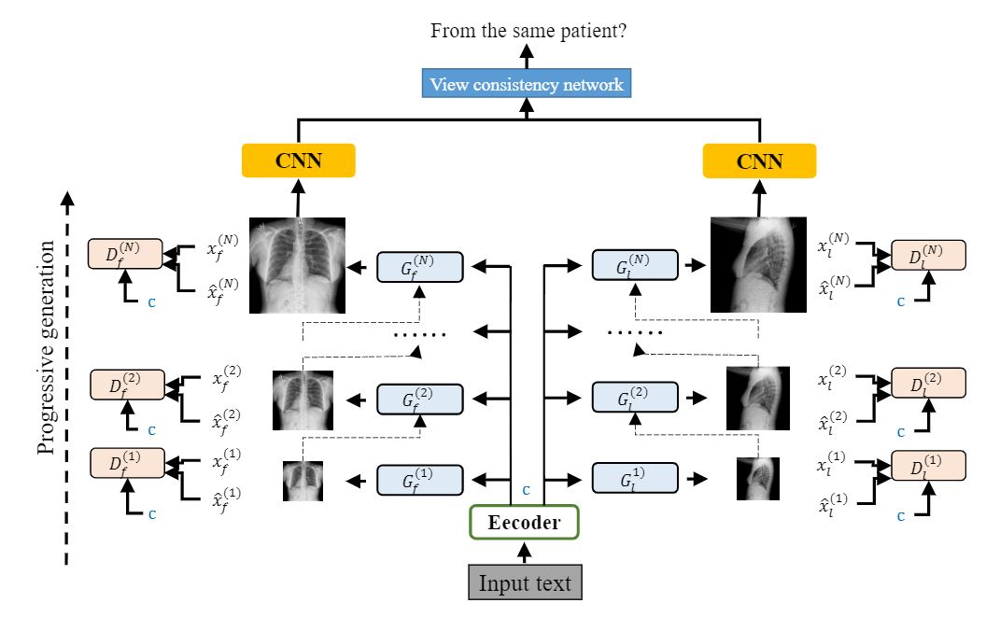

# XRayGAN: Consistency-preserving Generation of X-ray Images from Radiology Reports

This is the Pytorch implementaion of paper

**XRayGAN: Consistency-preserving Generation of X-ray Images from Radiology Reports**

*Xingyi Yang, Nandiraju Gireesh, Eric Xing, Pengtao Xie*



This repo contains the code
1. Implement XRayGAN for X-ray generation from medical report
2. Train/Evaluate on Open-i and MIMIC-p10 dataset
3. Compute SSIM, Inception sore, FID for GAN evaluation
4. Re-implement of [AttnGAN](http://openaccess.thecvf.com/content_cvpr_2018/papers/Xu_AttnGAN_Fine-Grained_Text_CVPR_2018_paper.pdf), [StackGAN](http://openaccess.thecvf.com/content_ICCV_2017/papers/Zhang_StackGAN_Text_to_ICCV_2017_paper.pdf) and [GAN-INT-CLS](https://arxiv.org/pdf/1605.05396.pdf) for X-ray generation

## Dependency
  - pytorch=1.3.0
  - torchvision
  - pydicom
  - tensorboard=1.14.0
  - tqdm
  - pandas
  - opencv
  - matplotlib

## File Orgnization
```
    - CheXNet   : Feature extractor for IS,FID score

    - config    : Configuration(Hyperparameter, path and dataset) for code running
        - $DatasetName$_$ModelName$.json        : Train Config
        - $DatasetName$_$ModelName$_test.json   : Test Config
        - $DatasetName$_images.csv              : Name index of images
        - $DatasetName$_reports.csv             : Name index of reports


    - models
        - AttnGAN.py    : Reimplementation of AttnGAN
        - StackGAN.py   : Reimplementation of StackGAN
        - Encoder.py
        - Decoder.py
        - Discriminator.py
        - HALSTM.py     : Implementation of Word Attntion/Sentence Attntion
        - Siamese.py    : View Consistency Network

    - utils
        - $Evaluation metrics$.py        : Compute evaluation metrics
        - $DatasetName$DataSet.py        : Data loader
        - create_csv_for$DatasetName$.py : Create Namelist for dataset
        - proprcessing.py

    - openi_report_$subset$.csv : Data-split for openi dataset
    - evaluate.py
    - tester_$ModelName$.py
    - trainer_$ModelName$.py

```

## Dataset
We use two dataset:
1. [Open-i](https://openi.nlm.nih.gov/faq#collection)
   - Download the compress file, uncompress it
   - Create name list for it using
   ```
        python create_csv_foropeni.py
   ```
2. [MIMIC-CXR](https://mimic.physionet.org/)
   - To access MIMIC-CXR, you need first sign angreement on the official website
   - Download the compress file, uncompress it
   - Create name list for it using
   ```
        create_csv_forMIMIC.py
   ```
## Usage
0. [**Optional**] Download checkpoint from google drive
- XRayGAN checkpoint
    - https://drive.google.com/file/d/13iiT_kdMQzGA7t914VyEl0O_kql8Q1Y5/view?usp=sharing
- CheXNet checkpoints
    - https://drive.google.com/file/d/1gouomLG3R69BGsBtnHbTiSYOKv9jpt-A/view?usp=sharing
- View consistency network checkpoint
    - https://drive.google.com/file/d/1pimDjLn1-emZM-EkBdoZTgg_VC6k_j3l/view?usp=sharing
1. Train you Generative model to generate X-rays
    - Edit the config file for hyperparamter setting. Example:
    ```
        {
      "EXPER_NAME":"Text-to-image XRayGAN OPENI256",
      "ENCODER":"harchyENCODER",
      "DECODER":"baseDECODERv3",
      "DISCRIMINATOR":"PDISCRIMINATOR",
      "RNN_CELL":"LSTM",

      "beta1" : 0.9,
      "E_HIDEN_SIZE":128,
      "E_EMBED_SIZE":128,

      "D_CHANNEL_SIZE":512,

      "DIS_CHANNEL_SIZE":64,

      "DATASET":"OPENI",
      "GPU_ID": "0,1,2,3",
      "DICTIONARY":"dict.json",
      "CHECKPOINT_ENCODER": "./checkpoint/OPENI/XRayGAN/encoder",
      "CHECKPOINT_DECODER": "./checkpoint/OPENI/XRayGAN/decoder",
      "CHECKPOINT_D": "./checkpoint/OPENI/XRayGAN/D",
      "DATA_ROOT": "./data",
      "TEXT_CSV": "./config/openi_reports.csv",
      "IMG_CSV": "./config/openi_images.csv",

      "CONTENT_LOSS":"L2",
      "ONLY_G_LR": 0.0002,
      "IMAGE_SIZE":[256,256],
      "BATCH_SIZE": [96,48,24,12],
      "MAX_EPOCH": [90,90,120,120],
      "SIAMESE_EPOCH": [15,15,15,20],
      "G_initer": 1,
      "D_initer": 1,
      "LR_DECAY_EPOCH": [[45],[45,70],[45,70,90],[45,70,90]],
      "CHECKPOINT_EPOCH": 10,
      "LR_SIAMESE_DECAY_EPOCH": 10,
      "G_LR": [0.0003,0.0003,0.0002,0.0001],
      "D_LR": [0.0003,0.0003,0.0002,0.0001],
      "S_LR": 0.01,
      "PIXEL_LOSS_RATIO":100,
      "ADV_LOSS_RATIO":1,
      "ID_LOSS_RATIO":1
    }

    ```
    - Run the trainer that you want(Checkpoint, Tensorboard record will be automaticaly saved)

2. Test you model to generate Xrays
     - Edit the config file for checkoint path setting. Then Run the code to save the images to a foler. Example:
    ```
      {
      "EXPER_NAME":"Text-to-image XRayGAN Open-i",
      "ENCODER":"harchyENCODER",
      "DECODER":"baseDECODERv3",
      "PDECODER":"PDECODERv3",
      "DISCRIMINATOR":"PDISCRIMINATOR",
      "RNN_CELL":"LSTM",
      "beta1" : 0.9,
      "E_HIDEN_SIZE":128,
      "E_EMBED_SIZE":128,

      "D_CHANNEL_SIZE":512,

      "DIS_CHANNEL_SIZE":64,
      "DATASET":"MIMIC-CXR",
      "GPU_ID": "0,1",
      "DICTIONARY":"dict.json",
      "RESUME_ENCODER": "./checkpoint/OPENI/XRayGAN/encoder/Encoder_harchyENCODER_epoch_140_checkpoint.pth",
      "RESUME_DECODER_F": "./checkpoint/OPENI/XRayGAN/decoder/Decoder_baseDECODERv3_F_epoch_140_checkpoint.pth",
      "RESUME_DECODER_L": "./checkpoint/OPENI/XRayGAN/decoder/Decoder_baseDECODERv3_L_epoch_140_checkpoint.pth",
      "RESUME_D":"null",

      "DATA_ROOT": "./data",
      "TEXT_CSV": "./config/openi_reports.csv",
      "IMG_CSV": "./config/openi_images.csv",
      "CONTENT_LOSS": "L2",
      "IMAGE_SIZE":[256,256]
    }
    ```

3. Evaluate. We provide the evaluation code. Just save the generated images and original image in two folder. Then Run
    ```
        python evaluate.py\
        --path1 [path to the generated images]
        --path2 [path to the original images]
        --Sia_resume    [path to the VCN checkpoint]
    ```